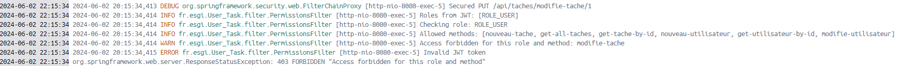

# API de Gestion des Utilisateurs et des Tâches

Cette API permet de gérer les utilisateurs et les tâches. Elle inclut des fonctionnalités CRUD (Create, Read, Update, Delete) pour les deux entités, ainsi qu'un système d'authentification basé sur JWT (JSON Web Token).

## Table des Matières

- [Technologies CRUD](#technologies)
- [Installation CRUD](#installation)
- [Structure du Projet CRUD](#structure-du-projet)
- [Fonctionnalités CRUD](#fonctionnalités)
- [Endpoints API CRUD](#endpoints-api)
- [DTOs](#dtos)

## Technologies CRUD

- Spring Boot
- Java
- JWT (JSON Web Tokens)
- Lombok

## Installation CRUD

1. Clonez le dépôt :
   ```bash
   git clone https://github.com/votre-repo/votre-projet.git
   ```
2. Accédez au répertoire du projet :
   ```bash
   cd votre-projet
   ```
3. Configurez le fichier `application.properties` avec vos informations de base de données.
4. Démarrez l'application :
   ```bash
   ./mvnw spring-boot:run
   ```

## Structure du Projet CRUD

```plaintext
src/
├── main/
│   ├── java/
│   │   ├── fr/
│   │   │   ├── esgi/
│   │   │   │   ├── User_Task/
│   │   │   │   │   ├── application/
│   │   │   │   │   │   ├── controller/
│   │   │   │   │   │   │   ├── TacheController.java
│   │   │   │   │   │   │   ├── UtilisateurController.java
│   │   │   │   │   │   ├── dto/
│   │   │   │   │   │   │   ├── tache/
│   │   │   │   │   │   │   │   ├── InTacheDto.java
│   │   │   │   │   │   │   │   ├── OutTacheDto.java
│   │   │   │   │   │   │   ├── permission/
│   │   │   │   │   │   │   ├── JwtPayload.java
│   │   │   │   │   │   │   ├── InUtilisateurDto.java
│   │   │   │   │   │   │   ├── OutUtilisateurDto.java
│   │   │   │   │   ├── mapper/
│   │   │   │   │   │   ├── DtoToDomainUtilisateurMapper.java
│   │   │   │   │   │   ├── TacheDtoToDomainMapper.java
│   │   │   │   │   │── DataInitializer.java
│   │   │   │   │   │── config/
│   │   │   │   │   │   ├── SecurityConfig.java
│   │   │   │   │   │   ├── FilterConfiguration.java
│   │   │   │   │   ├── domain/
│   │   │   │   │   │   ├── ports/
│   │   │   │   │   │   │   ├── api/
│   │   │   │   │   │   │   │   ├── ITacheService.java
│   │   │   │   │   │   │   │   ├── IUtilisateurService.java
│   │   │   │   │   │   │   │   ├── TacheService.java
│   │   │   │   │   │   │   │   ├── UtilisateurService.java
│   │   │   │   │   │   │   ├── spi/
│   │   │   │   │   │   │   │   ├── ITacheDao.java
│   │   │   │   │   │   │   │   ├── IUtilisateurDao.java
│   │   │   │   │   │   │   ├── Tache.java
│   │   │   │   │   │   │   ├── Utilisateur.java
│   │   │   │   │   │   ├── filter/
│   │   │   │   │   │   │   ├── PermissionsFilter.java
│   │   │   │   │   │   ├── infrastructure/
│   │   │   │   │   │   │   ├── adapter/
│   │   │   │   │   │   │   │   ├── TacheDao.java
│   │   │   │   │   │   │   │   ├── UtilisateurDao.java
│   │   │   │   │   │   │   ├── entity/
│   │   │   │   │   │   │   │   ├── TacheEntity.java
│   │   │   │   │   │   │   │   ├── UtilisateurEntity.java
│   │   │   │   │   │   │   ├── mapper/
│   │   │   │   │   │   │   │   ├── EntityToDomainMapper.java
│   │   │   │   │   │   │   │   ├── TacheDomainToEntityMapper.java
│   │   │   │   │   │   │   ├── repository/
│   │   │   │   │   │   │   │   ├── TacheRepository.java
│   │   │   │   │   │   │   │   ├── UtilisateurRepository.java
│   │   │   │   ├── UserTaskApplication.java
├── resources/
│   ├── application.properties
```

## Fonctionnalités CRUD

### Gestion des Autorisations

#### Fonctionnement de l'Authentification et des Autorisations
- L'API utilise un système d'authentification basé sur les JWT pour sécuriser les endpoints. Voici comment cela fonctionne :

- Génération du JWT : Lorsqu'un utilisateur se connecte via l'API d'authentification, un JWT est généré et renvoyé au client. Ce JWT contient les informations de l'utilisateur, y compris ses rôles.

- En-tête d'Autorisation : Pour accéder aux endpoints sécurisés, le client doit inclure le JWT dans l'en-tête Authorization de chaque requête HTTP sous la forme Bearer <JWT>.

- Filtre de Permissions : Un filtre de permissions (PermissionsFilter) est appliqué aux requêtes pour vérifier le JWT et s'assurer que l'utilisateur a les autorisations nécessaires pour accéder à l'endpoint.

### Gestion des Tâches

- Création, lecture, mise à jour et suppression de tâches.

### Gestion des Utilisateurs

- Création, lecture, mise à jour et suppression d'utilisateurs.

### Gestion des Rôles

- Les utilisateurs peuvent avoir un ou plusieurs rôles, qui déterminent les autorisations dont ils disposent.

Exemple : Un utilisateur avec le rôle "ADMIN" peut accéder à tous les endpoints, tandis qu'un utilisateur avec le rôle "USER" peut seulement accéder à certains endpoints.
Ici un rôle "USER" ne peut modifier que les tâches qu'il a créées.



## Endpoints API CRUD

### Tâches

- **GET /api/taches/get-all-taches** : Récupérer toutes les tâches.
- **GET /api/taches/get-tache-by-id/{id}** : Récupérer une tâche par son ID.
- **POST /api/taches/nouveau-tache** : Créer une nouvelle tâche.
- **PUT /api/taches/modifie-tache/{id}** : Mettre à jour une tâche existante.
- **DELETE /api/taches/supprimer-tache/{id}** : Supprimer une tâche.

### Utilisateurs

- **GET /api/utilisateurs/get-all-utilisateurs** : Récupérer tous les utilisateurs.
- **GET /api/utilisateurs/get-utilisateur-by-id/{id}** : Récupérer un utilisateur par son ID.
- **POST /api/utilisateurs/nouveau-utilisateur** : Créer un nouvel utilisateur.
- **PUT /api/utilisateurs/modifie-utilisateur/{id}** : Mettre à jour un utilisateur existant.
- **DELETE /api/utilisateurs/supprimer-utilisateur/{id}** : Supprimer un utilisateur.
